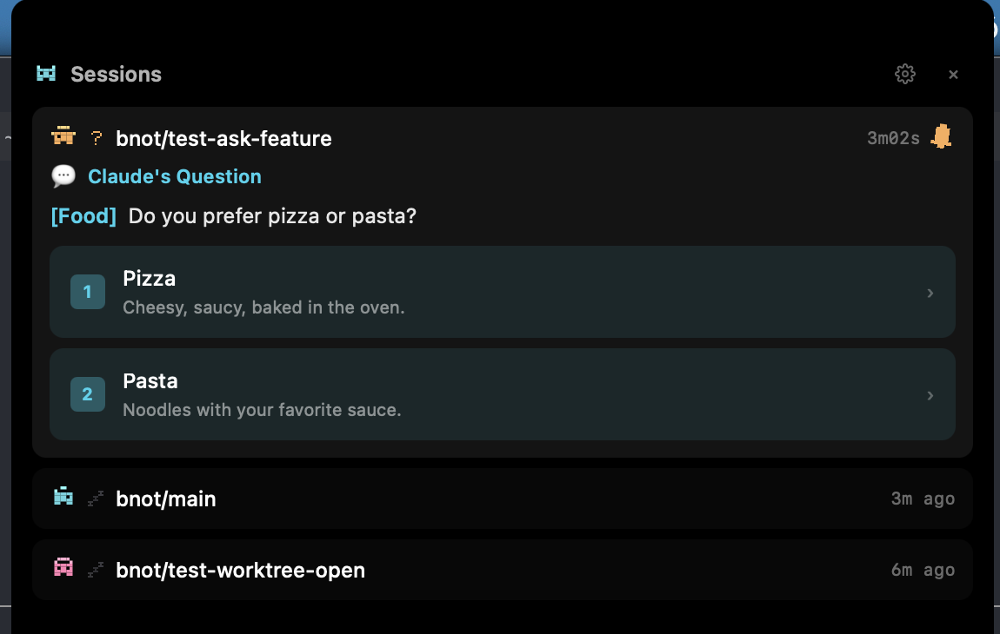

<div align="center">


# Bnot

### Claude Code, live in your notch.

**Every session, every worktree — one glance, one keystroke away.**

[**bnot.app**](https://www.bnot.app/) · [Chrome extension](https://chromewebstore.google.com/detail/bnot-open-in-worktree/adnnijpecjdlmkkbhajlgigikfdihhpl)

<br />


</div>

<br />

Bnot turns your MacBook's notch into mission control for Claude Code. Every running session, every worktree you've ever spun up, every pending approval — all alive in a panel that lives where your eyes already are. No more hunting through terminal tabs to find the agent waiting on you. No more re-typing `git worktree add` to remember where that half-finished refactor went. No more guessing how close you are to blowing the context window.

One glance — you know. One keystroke — you're back in the code.

<div align="center">



<sub>Sessions, worktrees, and approvals — one keystroke away.</sub>

</div>

## Features

- **Live session radar** — auto-detects every running Claude Code session via process scanning and hook integration. Zero setup.
- **Worktrees, always at your fingertips** — a dedicated tab lists every worktree you've spun up, ranked by the one you touched most recently. Live sessions get an **Active** badge. Dormant ones are one keystroke away from a fresh terminal.
- **Keyboard-first panel** — `←/→` flip between Sessions and Worktrees, `↑/↓` pick a row, `Enter` opens it, `Esc` collapses. No mouse required.
- **One-keystroke jump or spawn** — hit `Enter` on a live worktree, Bnot jumps straight to its terminal tab. Hit `Enter` on a dormant one, Bnot spawns `claude` there for you.
- **Exact context window readout** — token counts pulled from the source of truth, not estimated. Auto-compact window respected. You'll see the wall before you hit it.
- **Approve from the notch** — Claude's permission requests show up with diff previews. Approve, deny, or allow-always without leaving the notch.
- **Plan-mode aware** — sessions in plan mode show an animated `PLAN` badge, so you know when Claude is drafting vs. executing.
- **Answer questions instantly** — `AskUserQuestion` prompts render inline, with multi-select checkboxes and step-by-step flows for multi-question asks. No context switch.
- **Worktree-first PRs** — the optional [Chrome extension](https://chromewebstore.google.com/detail/bnot-open-in-worktree/adnnijpecjdlmkkbhajlgigikfdihhpl) adds an "Open in worktree" button on GitHub PR pages that spins up a git worktree and opens it in your terminal.
- **A bnot per session** — deterministic pixel-art character (color, hat, ears) hashed from your repo + branch, with its color auto-synced to the Claude Code tab via `/color`. The notch and your terminal match at a glance.
- **Usage & health at a glance** — settings menu surfaces your Claude 5h/7d quota with reset time, hook health with one-click repair, and a check-for-updates button.
- **Knows when to rest** — idle detection puts the bnot to sleep with a gentle Zzz animation when nothing's running.

## Built for Claude Code

> Bnot is optimized for [Claude Code](https://claude.com/claude-code) running in [Ghostty](https://ghostty.org/). iTerm and Warp work, with reduced fidelity for tab/pane jumping.

## Install

### Download the DMG

1. Download the latest `.dmg` from the [Releases page](https://github.com/ababol/bnot/releases/latest).
2. Open it and drag `Bnot.app` to `/Applications`.
3. Launch Bnot.

Bnot auto-updates in the background — new releases install on next launch, or you can trigger a check from the settings menu.

### Build from source

```bash
pnpm install
pnpm build
```

Produces a `.app` bundle in `apps/desktop/target/release/bundle/`.

### Accessibility permission

CGEvent keyboard injection (for terminal tab jumping) requires macOS Accessibility permission. The OS will prompt on first use.

## Development

```bash
pnpm install
pnpm dev
```

Requires macOS 14+, [Rust](https://rustup.rs/), Node.js 22+, and pnpm (`npm install -g pnpm`).

Tauri v2 (Rust) + React 19 + Tailwind v4 on the front, a Node.js sidecar and a small Rust CLI bridge on the back. Architecture details, IPC protocol, and internals are in [CLAUDE.md](CLAUDE.md).

## Inspiration

Bnot is inspired by [vibeisland.app](https://vibeisland.app/) — go check it out.

## License

[Source Available](LICENSE.md) — free to use, modify, and share. Cannot be resold or offered as a competing commercial product.
